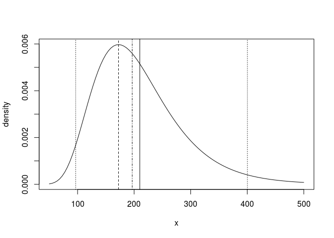

<!-- 
README.md is generated from README.Rmd. Please edit that file
rmarkdown::render("README.Rmd") 
-->
[](http://cran.r-project.org/package=lognorm) [](https://travis-ci.org/bgctw/lognorm)

Overview
--------

The `lognorm` package provides support for the univariate [lognormal distribution](https://en.wikipedia.org/wiki/Log-normal_distribution). It helps

-   estimating distribution parameters from observations statistics
-   computing moments and other statistics
-   approximate the sum of several lognormally distributed random variables

Installation
------------

``` r
# From CRAN
install.packages("lognorm")

# Or the the development version from GitHub:
# install.packages("devtools")
devtools::install_github("bgctw/lognorm")
```

Usage
-----

A simple example computes the distribution parameters of the sum of two correlated lognormal parameters.

``` r
require(lognorm)
means <- c(110,100)
sigmaStar <- c(1.5,1.5)
corr <- setMatrixOffDiagonals(diag(nrow = 2), value = 0.6, isSymmetric = TRUE)
#
# estimate paramters of terms 
coefTerms <- getParmsLognormForExpval(means, sigmaStar)
# approximate sum of the two correlated term
coefSum <- estimateSumLognormal( coefTerms[,"mu"], coefTerms[,"sigma"], corr = corr )
#
# plot statistics of distribution 
x <- seq(50,500,length.out = 100)
density <- dlnorm(x, coefSum["mu"], coefSum["sigma"])
plot(density ~ x, type = "l")
# confidence intervals
abline(v = qlnorm(c(0.025, 0.975), coefSum["mu"], coefSum["sigma"]), lty = "dotted")
# expected value
abline(v = getLognormMoments(coefSum["mu"], coefSum["sigma"])[1,"mean"])
# mode
abline(v = getLognormMode(coefSum["mu"], coefSum["sigma"]), lty = "dashed")
# median
abline(v = getLognormMedian(coefSum["mu"], coefSum["sigma"]), lty = "dotdash")
```



The sum of the expected values is conserved, while the mutliplicative standard deviation decreases during aggregation:

``` r
c( 
  mean = unname(getLognormMoments(coefSum["mu"], coefSum["sigma"])[1,"mean"])
  , sigmaStar = unname(exp(coefSum["sigma"])))
#>       mean  sigmaStar 
#> 210.000000   1.437293
```

See the [package vignettes](https://github.com/bgctw/lognorm/tree/master/vignettes) (\*.md) for further examples.
